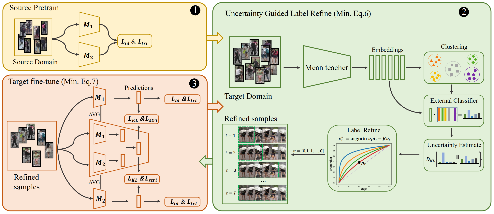
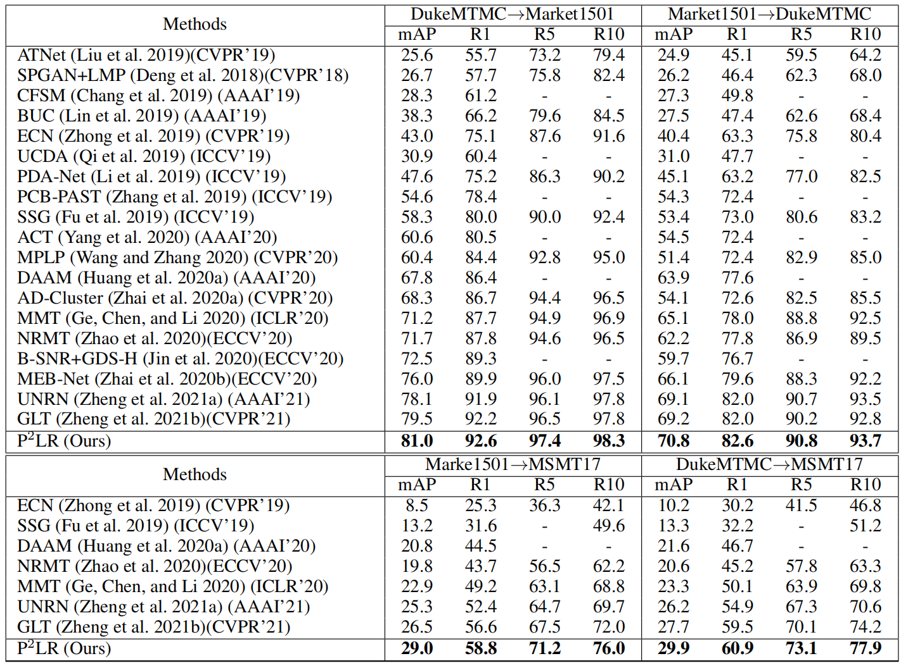

# Probabilistic uncertainty guided Progressive Label Refinery (P2LR)

The *official* implementation for the [Delving into Probabilistic Uncertainty for Unsupervised Domain Adaptive Person Re-Identification](https://arxiv.org/abs/2112.14025) which is accepted by [AAAI-2022](https://aaai.org/Conferences/AAAI-22/). Note that this repo in build upon [MMT](https://github.com/yxgeee/MMT).




## What's New

#### [Dec 21st, 2021]
+ We clean up our code and submit the first commit to github.

## Installation

```shell
git clone git@github.com:JeyesHan/P2LR.git
cd P2LR
pip install -r requirements.txt
```

## Prepare Datasets

```shell
cd examples && mkdir data
```
Download the raw datasets [DukeMTMC-reID](https://arxiv.org/abs/1609.01775), [Market-1501](https://www.cv-foundation.org/openaccess/content_iccv_2015/papers/Zheng_Scalable_Person_Re-Identification_ICCV_2015_paper.pdf), [MSMT17](https://arxiv.org/abs/1711.08565),
and then unzip them under the directory like
```
MMT/examples/data
├── dukemtmc
│   └── DukeMTMC-reID
├── market1501
│   └── Market-1501-v15.09.15
└── msmt17
    └── MSMT17_V1
```

## Custom Datasets
Change Line 24 of P2LR/datasets/custom.py to the path of your_custom_dataset. If your have multiple custom datasets, you can copy and rewrite P2LR/datasets/custom.py according to your data.
```
MMT/examples/data
├── dukemtmc
│   └── DukeMTMC-reID
├── market1501
│   └── Market-1501-v15.09.15
└── custom
    └── your_custom_dataset
        |── trianval
        |── probe
        └── gallery
    
```

## Example #1:
Transferring from [DukeMTMC-reID](https://arxiv.org/abs/1609.01775) to [Market-1501](https://www.cv-foundation.org/openaccess/content_iccv_2015/papers/Zheng_Scalable_Person_Re-Identification_ICCV_2015_paper.pdf) on the backbone of [ResNet-50](https://arxiv.org/abs/1512.03385), *i.e. Duke-to-Market (ResNet-50)*.

### Train
We utilize 4 TITAN XP GPUs for training.

**An explanation about the number of GPUs and the size of mini-batches:**
+ We adopted 4 GPUs with a batch size of 64, since we found 16 images out of 4 identities in a mini-batch benefits the learning of BN layers, achieving optimal performance.
+ It is fine to try other hyper-parameters, i.e. GPUs and batch sizes. I recommend to remain a mini-batch of 16 images for the BN layers, e.g. use a batch size of 32 for 2 GPUs training, etc.

#### Stage I: Pre-training on the source domain

```shell
sh scripts/pretrain.sh dukemtmc market1501 resnet50 1
sh scripts/pretrain.sh dukemtmc market1501 resnet50 2
```

#### Stage II: End-to-end training with P2LR
We utilized K-Means clustering algorithm in the paper.

```shell
sh scripts/train_P2LR_kmeans.sh dukemtmc market1501 resnet50 500 0.3
```

### Test
We utilize 1 GPU for testing.
Test the trained model with best performance by
```shell
sh scripts/test.sh market1501 resnet50 logs/dukemtmcTOmarket1501/resnet-P2LR-500/model_best.pth.tar
```


## Other Examples:
**Market-to-Duke (ResNet-50)**
```shell
# pre-training on the source domain
sh scripts/pretrain.sh market1501 dukemtmc resnet 1
sh scripts/pretrain.sh market1501 dukemtmc resnet 2
# end-to-end training with P2LR
sh scripts/train_P2LR_kmeans.sh market1501 dukemtmc resnet50 700 0.2
# testing the best model
sh scripts/test.sh dukemtmc resnet logs/market1501TOdukemtmc/resnet-P2LR-700/model_best.pth.tar
```
**Market-to-MSMT (ResNet-50)**
```shell
# pre-training on the source domain
sh scripts/pretrain.sh market1501 msmt17 resnet 1
sh scripts/pretrain.sh market1501 msmt17 resnet 2
# end-to-end training with P2LR
sh scripts/train_P2LR_kmeans.sh market1501 msmt17 resnet50 1500 0.3
# testing the best model
sh scripts/test.sh msmt17 resnet logs/market1501TOmsmt17/resnet-P2LR-1500/model_best.pth.tar
```
**Duke-to-MSMT (ResNet-50)**
```shell
# pre-training on the source domain
sh scripts/pretrain.sh dukemtmc msmt17 resnet 1
sh scripts/pretrain.sh dukemtmc msmt17 resnet 2
# end-to-end training with P2LR
sh scripts/train_P2LR_kmeans.sh dukemtmc msmt17 resnet50 1500 0.3
# testing the best model
sh scripts/test.sh msmt17 resnet logs/dukemtmcTOmsmt17/resnet-P2LR-1500/model_best.pth.tar
```


## Download Trained Models
*Source-domain pre-trained models and all our P2LR models in the paper can be downloaded from the [link](https://drive.google.com/file/d/1cQqWIu32FLQdtcPeLhyJx2arVNkqa1Mp/view?usp=sharing).*



## Citation
If you find this code useful for your research, please cite our paper
```
@misc{han2021delving,
      title={Delving into Probabilistic Uncertainty for Unsupervised Domain Adaptive Person Re-Identification}, 
      author={Jian Han and Yali li and Shengjin Wang},
      year={2021},
      eprint={2112.14025},
      archivePrefix={arXiv},
      primaryClass={cs.CV}
}
```
